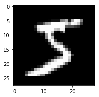
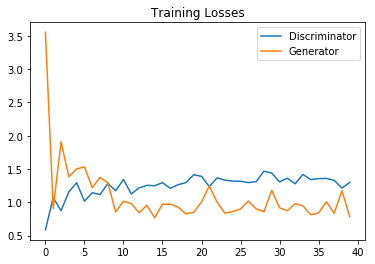
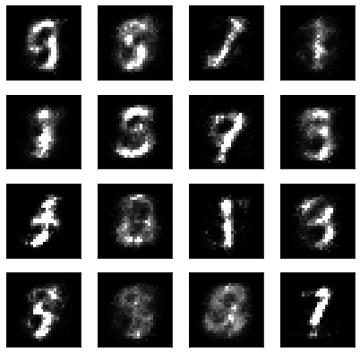
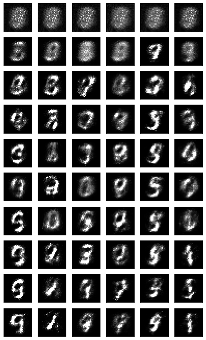
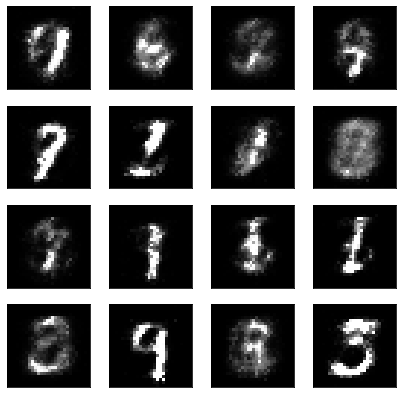

# Generative Adversarial Network

In this notebook, we'll be building a generative adversarial network (GAN) trained on the MNIST dataset. From this, we'll be able to generate new handwritten digits!

GANs were [first reported on](https://arxiv.org/abs/1406.2661) in 2014 from Ian Goodfellow and others in Yoshua Bengio's lab. Since then, GANs have exploded in popularity. Here are a few examples to check out:

* [Pix2Pix](https://affinelayer.com/pixsrv/) 
* [CycleGAN & Pix2Pix in PyTorch, Jun-Yan Zhu](https://github.com/junyanz/pytorch-CycleGAN-and-pix2pix)
* [A list of generative models](https://github.com/wiseodd/generative-models)

The idea behind GANs is that we have two networks, a generator $G$ and a discriminator $D$, competing against each other. The generator makes "fake" data to pass to the discriminator. The discriminator also sees real training data and predicts if the data it's received is real or fake. 
> * The generator is trained to fool the discriminator, it wants to output data that looks _as close as possible_ to real, training data. 
* The discriminator is a classifier that is trained to figure out which data is real and which is fake. 

What ends up happening is that the generator learns to make data that is indistinguishable from real data to the discriminator.


The general structure of a GAN is shown in the diagram above, using MNIST images as data. The latent sample is a random vector that the generator uses to construct its fake images. This is often called a **latent vector** and that vector space is called **latent space**. As the generator trains, it figures out how to map latent vectors to recognizable images that can fool the discriminator.

If we want to generate only new images, we can throw out the discriminator after training. This notebook will show how to define and train these adversarial networks in PyTorch and generate new images!


```python
%matplotlib inline

import numpy as np
import torch
import matplotlib.pyplot as plt
```


```python
from torchvision import datasets
import torchvision.transforms as transforms

# number of subprocesses to use for data loading
num_workers = 0
# how many samples per batch to load
batch_size = 64

# convert data to torch.FloatTensor
transform = transforms.ToTensor()

# get the training datasets
train_data = datasets.MNIST(root='data', train=True,
                                   download=True, transform=transform)

# prepare data loader
train_loader = torch.utils.data.DataLoader(train_data, batch_size=batch_size,
                                           num_workers=num_workers)
```

    0it [00:00, ?it/s]

    Downloading http://yann.lecun.com/exdb/mnist/train-images-idx3-ubyte.gz to data/MNIST/raw/train-images-idx3-ubyte.gz
    

    9920512it [00:02, 3611383.29it/s]                             
    

    Extracting data/MNIST/raw/train-images-idx3-ubyte.gz
    

    0it [00:00, ?it/s]

    Downloading http://yann.lecun.com/exdb/mnist/train-labels-idx1-ubyte.gz to data/MNIST/raw/train-labels-idx1-ubyte.gz
    

    32768it [00:00, 57220.93it/s]                           
    0it [00:00, ?it/s]

    Extracting data/MNIST/raw/train-labels-idx1-ubyte.gz
    Downloading http://yann.lecun.com/exdb/mnist/t10k-images-idx3-ubyte.gz to data/MNIST/raw/t10k-images-idx3-ubyte.gz
    

    1654784it [00:01, 955293.55it/s]                            
    0it [00:00, ?it/s]

    Extracting data/MNIST/raw/t10k-images-idx3-ubyte.gz
    Downloading http://yann.lecun.com/exdb/mnist/t10k-labels-idx1-ubyte.gz to data/MNIST/raw/t10k-labels-idx1-ubyte.gz
    

    8192it [00:00, 21549.78it/s]            

    Extracting data/MNIST/raw/t10k-labels-idx1-ubyte.gz
    Processing...
    Done!
    

    
    

### Visualize the data


```python
# obtain one batch of training images
dataiter = iter(train_loader)
images, labels = dataiter.next()
images = images.numpy()

# get one image from the batch
img = np.squeeze(images[0])

fig = plt.figure(figsize = (3,3)) 
ax = fig.add_subplot(111)
ax.imshow(img, cmap='gray')
```


    <matplotlib.image.AxesImage at 0x7f63d2ff6da0>





---
# Define the Model

A GAN is comprised of two adversarial networks, a discriminator and a generator.

## Discriminator

The discriminator network is going to be a pretty typical linear classifier. To make this network a universal function approximator, we'll need at least one hidden layer, and these hidden layers should have one key attribute:
> All hidden layers will have a [Leaky ReLu](https://pytorch.org/docs/stable/nn.html#torch.nn.LeakyReLU) activation function applied to their outputs.


#### Leaky ReLu

We should use a leaky ReLU to allow gradients to flow backwards through the layer unimpeded. A leaky ReLU is like a normal ReLU, except that there is a small non-zero output for negative input values.


#### Sigmoid Output

We'll also take the approach of using a more numerically stable loss function on the outputs. Recall that we want the discriminator to output a value 0-1 indicating whether an image is _real or fake_. 
> We will ultimately use [BCEWithLogitsLoss](https://pytorch.org/docs/stable/nn.html#bcewithlogitsloss), which combines a `sigmoid` activation function **and** and binary cross entropy loss in one function. 

So, our final output layer should not have any activation function applied to it.


```python
import torch.nn as nn
import torch.nn.functional as F

class Discriminator(nn.Module):

    def __init__(self, input_size, hidden_dim, output_size):
        super(Discriminator, self).__init__()
        
        # define hidden linear layers
        self.fc1 = nn.Linear(input_size, hidden_dim*4)
        self.fc2 = nn.Linear(hidden_dim*4, hidden_dim*2)
        self.fc3 = nn.Linear(hidden_dim*2, hidden_dim)
        
        # final fully-connected layer
        self.fc4 = nn.Linear(hidden_dim, output_size)
        
        # dropout layer 
        self.dropout = nn.Dropout(0.3)
        
        
    def forward(self, x):
        # flatten image
        x = x.view(-1, 28*28)
        # all hidden layers
        x = F.leaky_relu(self.fc1(x), 0.2) # (input, negative_slope=0.2)
        x = self.dropout(x)
        x = F.leaky_relu(self.fc2(x), 0.2)
        x = self.dropout(x)
        x = F.leaky_relu(self.fc3(x), 0.2)
        x = self.dropout(x)
        # final layer
        out = self.fc4(x)

        return out

```

    Discriminator(
      (fc1): Linear(in_features=30, out_features=240, bias=True)
      (fc2): Linear(in_features=240, out_features=120, bias=True)
      (fc3): Linear(in_features=120, out_features=1, bias=True)
      (drp): Dropout(p=0.5)
      (LRelu): LeakyReLU(negative_slope=0.2)
    )
    

## Generator

The generator network will be almost exactly the same as the discriminator network, except that we're applying a [tanh activation function](https://pytorch.org/docs/stable/nn.html#tanh) to our output layer.

#### tanh Output
The generator has been found to perform the best with $tanh$ for the generator output, which scales the output to be between -1 and 1, instead of 0 and 1. 


Recall that we also want these outputs to be comparable to the *real* input pixel values, which are read in as normalized values between 0 and 1. 
> So, we'll also have to **scale our real input images to have pixel values between -1 and 1** when we train the discriminator. 

we'll do this in the training loop, later on.


```python
class Generator(nn.Module):

    def __init__(self, input_size, hidden_dim, output_size):
        super(Generator, self).__init__()
        
        # define hidden linear layers
        self.fc1 = nn.Linear(input_size, hidden_dim)
        self.fc2 = nn.Linear(hidden_dim, hidden_dim*2)
        self.fc3 = nn.Linear(hidden_dim*2, hidden_dim*4)
        
        # final fully-connected layer
        self.fc4 = nn.Linear(hidden_dim*4, output_size)
        
        # dropout layer 
        self.dropout = nn.Dropout(0.3)

    def forward(self, x):
        # all hidden layers
        x = F.leaky_relu(self.fc1(x), 0.2) # (input, negative_slope=0.2)
        x = self.dropout(x)
        x = F.leaky_relu(self.fc2(x), 0.2)
        x = self.dropout(x)
        x = F.leaky_relu(self.fc3(x), 0.2)
        x = self.dropout(x)
        # final layer with tanh applied
        out = F.tanh(self.fc4(x))

        return out
```

## Model hyperparameters


```python
# Discriminator hyperparams

# Size of input image to discriminator (28*28)
input_size = 28*28
# Size of discriminator output (real or fake)
d_output_size = 1
# Size of *last* hidden layer in the discriminator
d_hidden_size = 32

# Generator hyperparams

# Size of latent vector to give to generator
z_size = 100
# Size of discriminator output (generated image)
g_output_size = 28*28
# Size of *first* hidden layer in the generator
g_hidden_size = 32
```

## Build complete network

Now we're instantiating the discriminator and generator from the classes defined above. 


```python
# instantiate discriminator and generator
D = Discriminator(input_size, d_hidden_size, d_output_size)
G = Generator(z_size, g_hidden_size, g_output_size)

# check that they are as you expect
print(D)
print()
print(G)
```

    Discriminator(
      (fc1): Linear(in_features=784, out_features=128, bias=True)
      (fc2): Linear(in_features=128, out_features=64, bias=True)
      (fc3): Linear(in_features=64, out_features=1, bias=True)
      (drp): Dropout(p=0.5)
      (LRelu): LeakyReLU(negative_slope=0.2)
    )
    
    Generator(
      (fc1): Linear(in_features=100, out_features=128, bias=True)
      (fc2): Linear(in_features=128, out_features=64, bias=True)
      (fc3): Linear(in_features=64, out_features=784, bias=True)
      (LRelu): LeakyReLU(negative_slope=0.2)
      (tanh): Tanh()
      (drp): Dropout(p=0.5)
    )
    

---
## Discriminator and Generator Losses

Now we need to calculate the losses. 

### Discriminator Losses

> * For the discriminator, the total loss is the sum of the losses for real and fake images, `d_loss = d_real_loss + d_fake_loss`. 
* Remember that we want the discriminator to output 1 for real images and 0 for fake images, so we need to set up the losses to reflect that.


The losses will by binary cross entropy loss with logits, which we can get with [BCEWithLogitsLoss](https://pytorch.org/docs/stable/nn.html#bcewithlogitsloss). This combines a `sigmoid` activation function **and** and binary cross entropy loss in one function.

For the real images, we want `D(real_images) = 1`. That is, we want the discriminator to classify the the real images with a label = 1, indicating that these are real. To help the discriminator generalize better, the labels are **reduced a bit from 1.0 to 0.9**. For this, we'll use the parameter `smooth`; if True, then we should smooth our labels. In PyTorch, this looks like `labels = torch.ones(size) * 0.9`

The discriminator loss for the fake data is similar. We want `D(fake_images) = 0`, where the fake images are the _generator output_, `fake_images = G(z)`. 

### Generator Loss

The generator loss will look similar only with flipped labels. The generator's goal is to get `D(fake_images) = 1`. In this case, the labels are **flipped** to represent that the generator is trying to fool the discriminator into thinking that the images it generates (fakes) are real!


```python
# Calculate losses
def real_loss(D_out, smooth=False):
    # compare logits to real labels
    # smooth labels if smooth=True
    target = torch.ones(D_out.size(0))
    
    if(smooth):
      target*=0.9
      
    criterian = nn.BCEWithLogitsLoss()
    loss = criterian(D_out.squeeze(),target)
    return loss

def fake_loss(D_out):
    # compare logits to fake labels
    target = torch.zeros(D_out.size(0))
    criterian = nn.BCEWithLogitsLoss()
    loss = criterian(D_out.squeeze(),target)
    return loss
```

## Optimizers

We want to update the generator and discriminator variables separately. So, we'll define two separate Adam optimizers.


```python
import torch.optim as optim

# learning rate for optimizers
lr = 0.002

# Create optimizers for the discriminator and generator
d_optimizer = optim.Adam(D.parameters(),lr)
g_optimizer = optim.Adam(G.parameters(),lr)
```

---
## Training

Training will involve alternating between training the discriminator and the generator. We'll use our functions `real_loss` and `fake_loss` to help us calculate the discriminator losses in all of the following cases.

### Discriminator training
1. Compute the discriminator loss on real, training images        
2. Generate fake images
3. Compute the discriminator loss on fake, generated images     
4. Add up real and fake loss
5. Perform backpropagation + an optimization step to update the discriminator's weights

### Generator training
1. Generate fake images
2. Compute the discriminator loss on fake images, using **flipped** labels!
3. Perform backpropagation + an optimization step to update the generator's weights

#### Saving Samples

As we train, we'll also print out some loss statistics and save some generated "fake" samples.


```python
import pickle as pkl

# training hyperparams
num_epochs = 40

# keep track of loss and generated, "fake" samples
samples = []
losses = []

print_every = 400

# Get some fixed data for sampling. These are images that are held
# constant throughout training, and allow us to inspect the model's performance
sample_size=16
fixed_z = np.random.uniform(-1, 1, size=(sample_size, z_size))
fixed_z = torch.from_numpy(fixed_z).float()

# train the network
D.train()
G.train()
for epoch in range(num_epochs):
    
    for batch_i, (real_images, _) in enumerate(train_loader):
                
        batch_size = real_images.size(0)
        
        ## Important rescaling step ## 
        real_images = real_images*2 - 1  # rescale input images from [0,1) to [-1, 1)
        
        # ============================================
        #            TRAIN THE DISCRIMINATOR
        # ============================================
                
        # 1. Train with real images

        # Compute the discriminator losses on real images
        # use smoothed labels
        d_optimizer.zero_grad()
        D_out = D(real_images)
        realLoss = real_loss(D_out,smooth=True) 
        # 2. Train with fake images
        
        # Generate fake images
        z = np.random.uniform(-1, 1, size=(batch_size, z_size))
        z = torch.from_numpy(z).float()
        fake_images = G(z)
        
        # Compute the discriminator losses on fake images 
        D_fake_out = D(fake_images)
        fakeLoss = fake_loss(D_fake_out)
        # add up real and fake losses and perform backprop
        d_loss = realLoss + fakeLoss
        
        
        d_loss.backward()
        d_optimizer.step()
        
        
        # =========================================
        #            TRAIN THE GENERATOR
        # =========================================
        
        # 1. Train with fake images and flipped labels
        g_optimizer.zero_grad()
        
        # Generate fake images
        z = np.random.uniform(-1, 1, size=(batch_size, z_size))
        z = torch.from_numpy(z).float()
        fake_images = G(z)
        # Compute the discriminator losses on fake images 
        # using flipped labels!
        
        # perform backprop
        
        D_fake_images = D(fake_images)
        g_loss = real_loss(D_fake_images)
        
        g_loss.backward()
        g_optimizer.step()
        

        # Print some loss stats
        if batch_i % print_every == 0:
            # print discriminator and generator loss
            print('Epoch [{:5d}/{:5d}] | d_loss: {:6.4f} | g_loss: {:6.4f}'.format(
                    epoch+1, num_epochs, d_loss.item(), g_loss.item()))

    
    ## AFTER EACH EPOCH##
    # append discriminator loss and generator loss
    losses.append((d_loss.item(), g_loss.item()))
    
    # generate and save sample, fake images
    G.eval() # eval mode for generating samples
    samples_z = G(fixed_z)
    samples.append(samples_z)
    G.train() # back to train mode


# Save training generator samples
with open('train_samples.pkl', 'wb') as f:
    pkl.dump(samples, f)
```

    Epoch [    1/   40] | d_loss: 1.3590 | g_loss: 0.6957
    Epoch [    1/   40] | d_loss: 0.4960 | g_loss: 5.8747
    Epoch [    1/   40] | d_loss: 0.9502 | g_loss: 1.8959
    Epoch [    2/   40] | d_loss: 0.6487 | g_loss: 3.8712
    Epoch [    2/   40] | d_loss: 0.9879 | g_loss: 1.1453
    Epoch [    2/   40] | d_loss: 1.1615 | g_loss: 1.0650
    Epoch [    3/   40] | d_loss: 1.1163 | g_loss: 0.7728
    Epoch [    3/   40] | d_loss: 0.8302 | g_loss: 1.9229
    Epoch [    3/   40] | d_loss: 1.0785 | g_loss: 1.6628
    Epoch [    4/   40] | d_loss: 0.8752 | g_loss: 1.6313
    Epoch [    4/   40] | d_loss: 0.8678 | g_loss: 1.4115
    Epoch [    4/   40] | d_loss: 0.9448 | g_loss: 1.8144
    Epoch [    5/   40] | d_loss: 1.0402 | g_loss: 1.1597
    Epoch [    5/   40] | d_loss: 0.9958 | g_loss: 1.5786
    Epoch [    5/   40] | d_loss: 1.2179 | g_loss: 1.0985
    Epoch [    6/   40] | d_loss: 1.0852 | g_loss: 1.1634
    Epoch [    6/   40] | d_loss: 1.0513 | g_loss: 1.5988
    Epoch [    6/   40] | d_loss: 1.4352 | g_loss: 1.0681
    Epoch [    7/   40] | d_loss: 1.1461 | g_loss: 1.4408
    Epoch [    7/   40] | d_loss: 1.0794 | g_loss: 1.0970
    Epoch [    7/   40] | d_loss: 1.1561 | g_loss: 1.0738
    Epoch [    8/   40] | d_loss: 1.3052 | g_loss: 1.1109
    Epoch [    8/   40] | d_loss: 1.2626 | g_loss: 1.1756
    Epoch [    8/   40] | d_loss: 1.4081 | g_loss: 0.8529
    Epoch [    9/   40] | d_loss: 1.1867 | g_loss: 1.2445
    Epoch [    9/   40] | d_loss: 1.3839 | g_loss: 0.8849
    Epoch [    9/   40] | d_loss: 1.2319 | g_loss: 1.3116
    Epoch [   10/   40] | d_loss: 1.3512 | g_loss: 1.1837
    Epoch [   10/   40] | d_loss: 1.2950 | g_loss: 0.9636
    Epoch [   10/   40] | d_loss: 1.2585 | g_loss: 1.0366
    Epoch [   11/   40] | d_loss: 1.2611 | g_loss: 0.9223
    Epoch [   11/   40] | d_loss: 1.2617 | g_loss: 0.8344
    Epoch [   11/   40] | d_loss: 1.2885 | g_loss: 1.0080
    Epoch [   12/   40] | d_loss: 1.2800 | g_loss: 1.0084
    Epoch [   12/   40] | d_loss: 1.2184 | g_loss: 1.1235
    Epoch [   12/   40] | d_loss: 1.3013 | g_loss: 0.9063
    Epoch [   13/   40] | d_loss: 1.3326 | g_loss: 0.9291
    Epoch [   13/   40] | d_loss: 1.2177 | g_loss: 1.1203
    Epoch [   13/   40] | d_loss: 1.3532 | g_loss: 0.9658
    Epoch [   14/   40] | d_loss: 1.3079 | g_loss: 1.0008
    Epoch [   14/   40] | d_loss: 1.3346 | g_loss: 0.8661
    Epoch [   14/   40] | d_loss: 1.4106 | g_loss: 0.8649
    Epoch [   15/   40] | d_loss: 1.2988 | g_loss: 1.0261
    Epoch [   15/   40] | d_loss: 1.2954 | g_loss: 0.9033
    Epoch [   15/   40] | d_loss: 1.3021 | g_loss: 1.0176
    Epoch [   16/   40] | d_loss: 1.3198 | g_loss: 0.9398
    Epoch [   16/   40] | d_loss: 1.3260 | g_loss: 0.8434
    Epoch [   16/   40] | d_loss: 1.3444 | g_loss: 0.9092
    Epoch [   17/   40] | d_loss: 1.4008 | g_loss: 0.9827
    Epoch [   17/   40] | d_loss: 1.3278 | g_loss: 0.9696
    Epoch [   17/   40] | d_loss: 1.3086 | g_loss: 1.0145
    Epoch [   18/   40] | d_loss: 1.2647 | g_loss: 0.9451
    Epoch [   18/   40] | d_loss: 1.3337 | g_loss: 0.8478
    Epoch [   18/   40] | d_loss: 1.3389 | g_loss: 0.8492
    Epoch [   19/   40] | d_loss: 1.3240 | g_loss: 1.0110
    Epoch [   19/   40] | d_loss: 1.3581 | g_loss: 0.9087
    Epoch [   19/   40] | d_loss: 1.3940 | g_loss: 0.9128
    Epoch [   20/   40] | d_loss: 1.3400 | g_loss: 0.8395
    Epoch [   20/   40] | d_loss: 1.2285 | g_loss: 1.0067
    Epoch [   20/   40] | d_loss: 1.4321 | g_loss: 0.9274
    Epoch [   21/   40] | d_loss: 1.3604 | g_loss: 0.8523
    Epoch [   21/   40] | d_loss: 1.3412 | g_loss: 0.8526
    Epoch [   21/   40] | d_loss: 1.3223 | g_loss: 0.9025
    Epoch [   22/   40] | d_loss: 1.4092 | g_loss: 0.9528
    Epoch [   22/   40] | d_loss: 1.3717 | g_loss: 0.9934
    Epoch [   22/   40] | d_loss: 1.3444 | g_loss: 0.9413
    Epoch [   23/   40] | d_loss: 1.3382 | g_loss: 1.2952
    Epoch [   23/   40] | d_loss: 1.2529 | g_loss: 1.0846
    Epoch [   23/   40] | d_loss: 1.2615 | g_loss: 0.9877
    Epoch [   24/   40] | d_loss: 1.3697 | g_loss: 0.9039
    Epoch [   24/   40] | d_loss: 1.3423 | g_loss: 0.8628
    Epoch [   24/   40] | d_loss: 1.3690 | g_loss: 0.9066
    Epoch [   25/   40] | d_loss: 1.2726 | g_loss: 0.8730
    Epoch [   25/   40] | d_loss: 1.2720 | g_loss: 0.9066
    Epoch [   25/   40] | d_loss: 1.2986 | g_loss: 0.8819
    Epoch [   26/   40] | d_loss: 1.2979 | g_loss: 0.8854
    Epoch [   26/   40] | d_loss: 1.2910 | g_loss: 0.9456
    Epoch [   26/   40] | d_loss: 1.3732 | g_loss: 0.9939
    Epoch [   27/   40] | d_loss: 1.3769 | g_loss: 0.8799
    Epoch [   27/   40] | d_loss: 1.2876 | g_loss: 0.8922
    Epoch [   27/   40] | d_loss: 1.3036 | g_loss: 0.9384
    Epoch [   28/   40] | d_loss: 1.3877 | g_loss: 0.9509
    Epoch [   28/   40] | d_loss: 1.3355 | g_loss: 0.8754
    Epoch [   28/   40] | d_loss: 1.3652 | g_loss: 0.8634
    Epoch [   29/   40] | d_loss: 1.3576 | g_loss: 0.9221
    Epoch [   29/   40] | d_loss: 1.3683 | g_loss: 0.8004
    Epoch [   29/   40] | d_loss: 1.3665 | g_loss: 0.9455
    Epoch [   30/   40] | d_loss: 1.2788 | g_loss: 0.8498
    Epoch [   30/   40] | d_loss: 1.3605 | g_loss: 0.8271
    Epoch [   30/   40] | d_loss: 1.3827 | g_loss: 0.9018
    Epoch [   31/   40] | d_loss: 1.2713 | g_loss: 0.9848
    Epoch [   31/   40] | d_loss: 1.3053 | g_loss: 1.0453
    Epoch [   31/   40] | d_loss: 1.3538 | g_loss: 0.8836
    Epoch [   32/   40] | d_loss: 1.4066 | g_loss: 0.9301
    Epoch [   32/   40] | d_loss: 1.3709 | g_loss: 0.8734
    Epoch [   32/   40] | d_loss: 1.4323 | g_loss: 1.0735
    Epoch [   33/   40] | d_loss: 1.3518 | g_loss: 0.8172
    Epoch [   33/   40] | d_loss: 1.3280 | g_loss: 0.9482
    Epoch [   33/   40] | d_loss: 1.4324 | g_loss: 0.8341
    Epoch [   34/   40] | d_loss: 1.2972 | g_loss: 0.9454
    Epoch [   34/   40] | d_loss: 1.3646 | g_loss: 0.8331
    Epoch [   34/   40] | d_loss: 1.3999 | g_loss: 0.8508
    Epoch [   35/   40] | d_loss: 1.3661 | g_loss: 1.0378
    Epoch [   35/   40] | d_loss: 1.3558 | g_loss: 0.8974
    Epoch [   35/   40] | d_loss: 1.3263 | g_loss: 0.8412
    Epoch [   36/   40] | d_loss: 1.3317 | g_loss: 0.8599
    Epoch [   36/   40] | d_loss: 1.3220 | g_loss: 0.8527
    Epoch [   36/   40] | d_loss: 1.3770 | g_loss: 0.9580
    Epoch [   37/   40] | d_loss: 1.3727 | g_loss: 0.8580
    Epoch [   37/   40] | d_loss: 1.2660 | g_loss: 0.8992
    Epoch [   37/   40] | d_loss: 1.3579 | g_loss: 1.0784
    Epoch [   38/   40] | d_loss: 1.3399 | g_loss: 1.0384
    Epoch [   38/   40] | d_loss: 1.2529 | g_loss: 0.9859
    Epoch [   38/   40] | d_loss: 1.3807 | g_loss: 1.0101
    Epoch [   39/   40] | d_loss: 1.3313 | g_loss: 0.9096
    Epoch [   39/   40] | d_loss: 1.3203 | g_loss: 1.0081
    Epoch [   39/   40] | d_loss: 1.3020 | g_loss: 0.9978
    Epoch [   40/   40] | d_loss: 1.3593 | g_loss: 1.0093
    Epoch [   40/   40] | d_loss: 1.2971 | g_loss: 0.9693
    Epoch [   40/   40] | d_loss: 1.3575 | g_loss: 0.8578
    

## Training loss

Here we'll plot the training losses for the generator and discriminator, recorded after each epoch.


```python
fig, ax = plt.subplots()
losses = np.array(losses)
plt.plot(losses.T[0], label='Discriminator')
plt.plot(losses.T[1], label='Generator')
plt.title("Training Losses")
plt.legend()
```


    <matplotlib.legend.Legend at 0x7f63bf56a390>





## Generator samples from training

Here we can view samples of images from the generator. First we'll look at the images we saved during training.


```python
# helper function for viewing a list of passed in sample images
def view_samples(epoch, samples):
    fig, axes = plt.subplots(figsize=(7,7), nrows=4, ncols=4, sharey=True, sharex=True)
    for ax, img in zip(axes.flatten(), samples[epoch]):
        img = img.detach()
        ax.xaxis.set_visible(False)
        ax.yaxis.set_visible(False)
        im = ax.imshow(img.reshape((28,28)), cmap='Greys_r')
```


```python
# Load samples from generator, taken while training
with open('train_samples.pkl', 'rb') as f:
    samples = pkl.load(f)
```

These are samples from the final training epoch. You can see the generator is able to reproduce numbers like 1, 7, 3, 2. Since this is just a sample, it isn't representative of the full range of images this generator can make.


```python
# -1 indicates final epoch's samples (the last in the list)
view_samples(-1, samples)
```





Below I'm showing the generated images as the network was training, every 10 epochs.


```python
rows = 10 # split epochs into 10, so 100/10 = every 10 epochs
cols = 6
fig, axes = plt.subplots(figsize=(7,12), nrows=rows, ncols=cols, sharex=True, sharey=True)

for sample, ax_row in zip(samples[::int(len(samples)/rows)], axes):
    for img, ax in zip(sample[::int(len(sample)/cols)], ax_row):
        img = img.detach()
        ax.imshow(img.reshape((28,28)), cmap='Greys_r')
        ax.xaxis.set_visible(False)
        ax.yaxis.set_visible(False)
```





It starts out as all noise. Then it learns to make only the center white and the rest black. You can start to see some number like structures appear out of the noise like 1s and 9s.

## Sampling from the generator

We can also get completely new images from the generator by using the checkpoint we saved after training. **We just need to pass in a new latent vector $z$ and we'll get new samples**!


```python
# randomly generated, new latent vectors
sample_size=16
rand_z = np.random.uniform(-1, 1, size=(sample_size, z_size))
rand_z = torch.from_numpy(rand_z).float()

G.eval() # eval mode
# generated samples
rand_images = G(rand_z)

# 0 indicates the first set of samples in the passed in list
# and we only have one batch of samples, here
view_samples(0, [rand_images])
```




